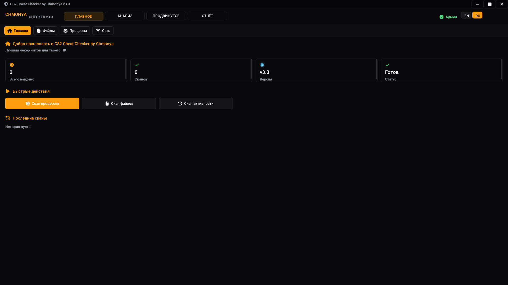
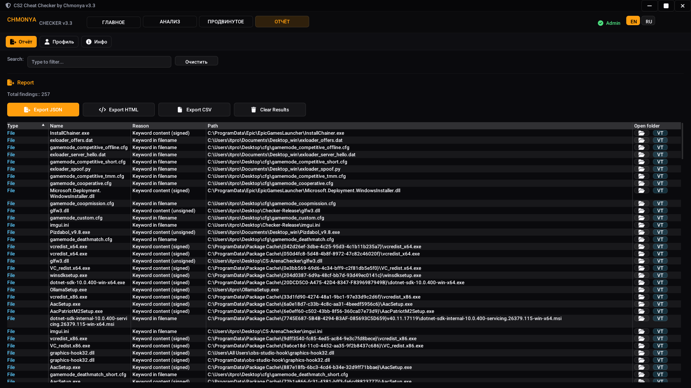
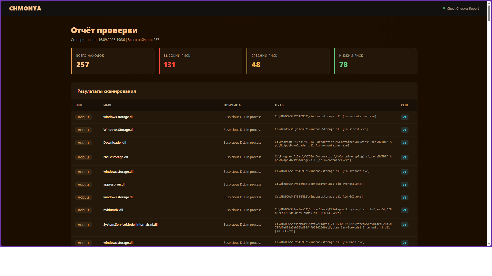

# CS2 Cheat Checker by Chmonya

**🌍 Language / Язык:** **[🇬🇧 English](#-english)** · **[🇷🇺 Русский](#-русский)**


---

## 🇬🇧 English

Forensic scanner for Windows that detects cheat traces across **processes, memory, registry, browser history, USB devices, Prefetch, and more**. Built for CS2 server admins and moderators who need **real evidence**, not guesses.

### 📦 Download

**[⬇️ Download the latest release](https://github.com/ChmonyaStudio/cs2-cheat-checker-by-chmonya/releases/latest)**

Portable `.exe`. No install, no dependencies — just run.

### ✨ Features

**17 scan modules:**
- 🔍 **Files** — cheat files by name + content, signature verify
- 🧠 **Processes** — running processes + loaded DLLs vs cheat keyword DB
- 💾 **Memory** — scan process memory for cheat strings (binary-safe Aho-Corasick)
- 🌐 **Network** — active connections and their owning processes
- 📅 **Tasks** — Windows Task Scheduler entries
- 👁️ **Hidden** — hidden/system files with cheat names
- 🔐 **Signatures** — unsigned EXE/DLL with cheat strings
- ⚙️ **Services** — Windows services with cheat names
- 🚀 **Autorun** — Run/RunOnce registry keys
- 💿 **Drivers** — known vulnerable kernel drivers (kdmapper, kdu, capcom, gdrv)
- 📊 **Activity** — UserAssist / BAM / MUICache / RecentDocs / TypedPaths / RunMRU / RDP
- 🔌 **USB** — connected USB storage devices
- 🎮 **Steam** — all Steam accounts that logged in on this PC
- 🌍 **Browser** — visited cheat-sites (100+ domains)
- 📝 **Browser Strings** — cheat-site URLs in browser memory
- 🎯 **CS2 Strings** — cheat strings inside CS2 process
- 🗂️ **Registry** — extended forensic registry paths

**Extra tools:**
- 📈 **VirusTotal** integration — one click from hash
- 📄 **Export** — JSON / HTML (with branding) / CSV
- 🎨 **Modern UI** — ImGui with dark theme
- 🎵 **Sound alerts** on findings
- 💬 **Discord Rich Presence**
- 🌐 **RU / EN** interface

### 🚀 Quick Start

#### 1. Download
Get `CheatChecker-v3.3.zip` from [Releases](https://github.com/ChmonyaStudio/cs2-cheat-checker-by-chmonya/releases/latest).

#### 2. Extract
```
CheatChecker/
├── CheatChecker.exe
├── assets/
│   ├── background.png   (optional)
│   ├── logo.png         (optional)
│   ├── favicon.ico      (optional)
│   ├── fa-solid-900.ttf (required for icons)
│   └── fa-brands-400.ttf
└── Tools/               (optional)
```

#### 3. Run as Administrator
```
Right-click CheatChecker.exe → Run as administrator
```

The app auto-requests UAC on launch.

#### 4. Scan
- Pick a module on the left
- Click **Start Scan**
- Wait for results
- Double-click a row → opens file in Explorer
- Click **VT** → opens VirusTotal with SHA256

#### 5. Export
Report tab → JSON / HTML / CSV

### 🎮 Use cases

- **Verify suspicious player** during a match
- **Investigate a ban appeal** with a formal HTML report
- **Cross-check** server AC detections with real evidence
- **Pre-match screening** of known cheaters

### 🛠️ Requirements

- **Windows 10 / 11** (x64)
- **Administrator rights** (for memory / driver scans)
- **~50 MB** disk space
- No installer, no dependencies

### 🔧 Building from source

Only if you want to modify:

```bash
git clone https://github.com/ChmonyaStudio/cs2-cheat-checker-by-chmonya
cd cs2-cheat-checker
# Open CS2CheatChecker.sln in Visual Studio 2022
# Build → Rebuild Solution (Release x64)
```

**Dependencies:**
- ImGui (docking branch)
- GLFW 3.3+
- OpenGL
- nlohmann/json
- stb_image
- Discord RPC
- IconsFontAwesome6

### 📋 Changelog

See [CHANGELOG.md](CHANGELOG.md).

### ⚠️ License

MIT — see [LICENSE](LICENSE).

### 💬 Contact

- **Website:** [chmonya.ct.ws](https://chmonya.ct.ws)
- **GitHub:** [@ChmonyaStudio](https://github.com/ChmonyaStudio)
- **Telegram:** [@p1zdabol4ik](https://t.me/p1zdabol4ik)

---

## 🇷🇺 Русский

Forensic-сканер для Windows, который ищет следы читов в **процессах, памяти, реестре, истории браузера, USB-устройствах, Prefetch и не только**. Сделан для админов CS2-серверов, которым нужны **реальные доказательства**, а не догадки.

### 📦 Скачать

**[⬇️ Скачать последний релиз](https://github.com/ChmonyaStudio/cs2-cheat-checker-by-chmonya/releases/latest)**

Портативный `.exe`. Без установки, без зависимостей.

### ✨ Возможности

**17 модулей сканирования:**
- 🔍 **Файлы** — читы по имени + содержимому, проверка подписи
- 🧠 **Процессы** — активные процессы + загруженные DLL по базе сигнатур
- 💾 **Память** — сканирование памяти процессов на чит-строки (binary-safe)
- 🌐 **Сеть** — активные соединения и их процессы
- 📅 **Задачи** — записи планировщика Windows
- 👁️ **Скрытое** — скрытые/системные файлы с чит-именами
- 🔐 **Сигнатуры** — неподписанные EXE/DLL с чит-строками
- ⚙️ **Службы** — Windows-сервисы с чит-именами
- 🚀 **Автозапуск** — ключи Run/RunOnce
- 💿 **Драйверы** — известные уязвимые драйверы (kdmapper, kdu, capcom, gdrv)
- 📊 **Активность** — UserAssist / BAM / MUICache / RecentDocs / TypedPaths / RunMRU / RDP
- 🔌 **USB** — подключённые USB-накопители
- 🎮 **Steam** — все Steam-аккаунты, что заходили на этот ПК
- 🌍 **Браузер** — посещённые чит-сайты (100+ доменов)
- 📝 **Строки браузера** — URL чит-сайтов в памяти
- 🎯 **Строки CS2** — чит-строки внутри процесса CS2
- 🗂️ **Реестр** — расширенные forensic-пути реестра

**Дополнительно:**
- 📈 **VirusTotal** — в один клик по хешу
- 📄 **Экспорт** — JSON / HTML (с брендингом) / CSV
- 🎨 **Современный интерфейс** — ImGui, тёмная тема
- 🎵 **Звуковые уведомления** при находках
- 💬 **Discord Rich Presence**
- 🌐 **RU / EN** интерфейс

### 🚀 Быстрый старт

#### 1. Скачай
Возьми `CheatChecker-v3.3.zip` из [Releases](https://github.com/ChmonyaStudio/cs2-cheat-checker-by-chmonya/releases/latest).

#### 2. Распакуй
```
CheatChecker/
├── CheatChecker.exe
├── assets/
│   ├── background.png   (опционально)
│   ├── logo.png         (опционально)
│   ├── favicon.ico      (опционально)
│   ├── fa-solid-900.ttf (обязательно для иконок)
│   └── fa-brands-400.ttf
└── Tools/               (опционально)
```

#### 3. Запусти от админа
```
ПКМ по CheatChecker.exe → Запуск от имени администратора
```

Приложение само запросит UAC.

#### 4. Сканируй
- Выбери модуль слева
- Нажми **Начать**
- Дождись результатов
- Двойной клик по строке → открыть в проводнике
- Клик **VT** → открыть VirusTotal с SHA256

#### 5. Экспорт
Вкладка Отчёт → JSON / HTML / CSV

### 🎮 Применение

- **Проверить подозрительного игрока** во время матча
- **Разобрать апелляцию бана** с формальным HTML-отчётом
- **Сверить детекты** серверного AC с реальными доказательствами
- **Предматчевый скрининг** известных читеров

### 🛠️ Требования

- **Windows 10 / 11** (x64)
- **Права администратора** (для сканов памяти / драйверов)
- **~50 МБ** на диске
- Без установки, без зависимостей

### 🔧 Сборка из исходников

Только если хочешь менять код:

```bash
git clone https://github.com/ChmonyaStudio/cs2-cheat-checker-by-chmonya
cd cs2-cheat-checker
# Открой CS2CheatChecker.sln в Visual Studio 2022
# Build → Rebuild Solution (Release x64)
```

**Зависимости:**
- ImGui (docking branch)
- GLFW 3.3+
- OpenGL
- nlohmann/json
- stb_image
- Discord RPC
- IconsFontAwesome6

### 📋 Changelog

См. [CHANGELOG.md](CHANGELOG.md).

### ⚠️ Лицензия

MIT — см. [LICENSE](LICENSE).

### 💬 Контакты

- **Сайт:** [chmonya.ct.ws](https://chmonya.ct.ws)
- **GitHub:** [@ChmonyaStudio](https://github.com/ChmonyaStudio)
- **Telegram:** [@p1zdabol4ik](https://t.me/p1zdabol4ik)

### 📸 Screenshots / Скриншоты





---

**Made with ❤️ for the CS2 community. / Сделано с ❤️ для CS2-сообщества.**
